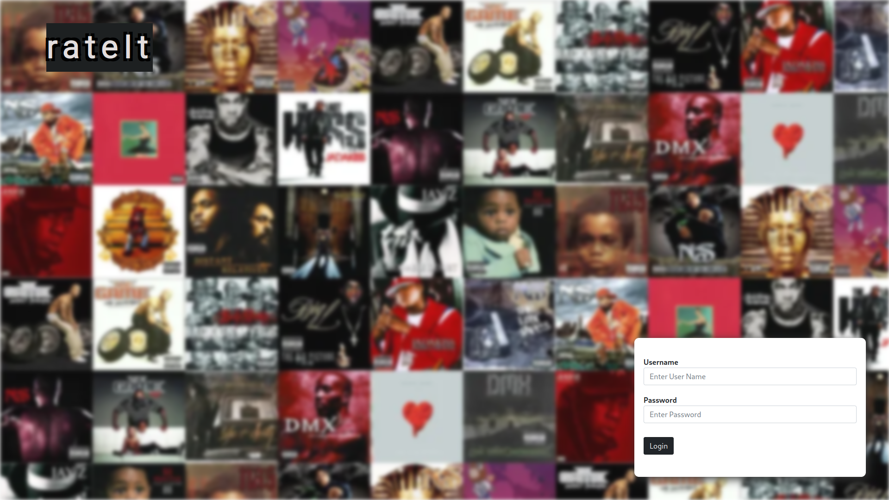
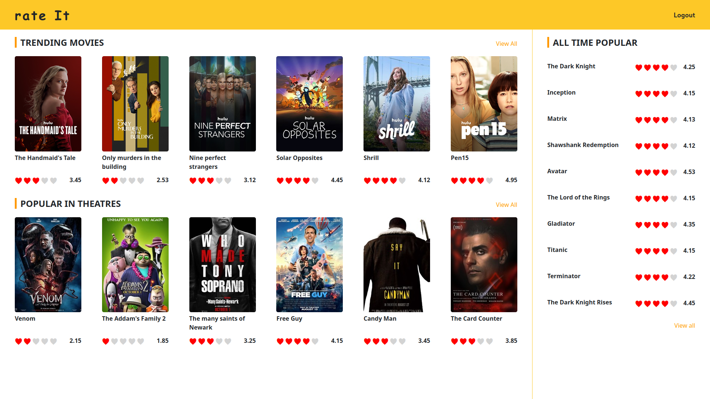
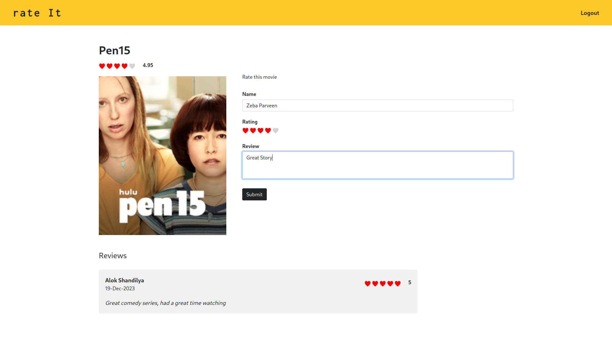

# TU-mini-project

This project was generated with
 - [Angular CLI](https://github.com/angular/angular-cli) version 11.1.4
 - `nodeJS` version 12.11.1
 - `fnm` as node version manager

This project currently lacked backend, currently relies on **_browser's local storage_**
 - will add in future

# Presentation

[Link](https://gamma.app/public/Rating-Review-Application-9z4u9nwy2y4noze)

# Run

`npm install` (downgrade node to v12.11.0) followed by `npm start` or `ng serve`

# Screenshots

